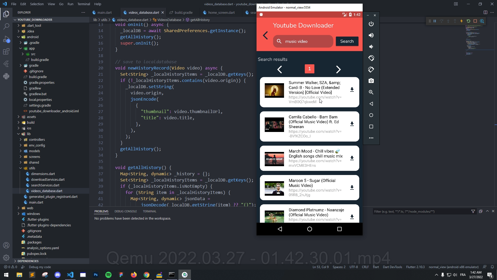

# youtube downloader made with Flutter + GetX

* createa a youtube api from https://console.cloud.google.com/apis/library/youtube.googleapis.com
* 
* make sure you change  your youtube API at env_config/youtube_config.dart

youtube preview : 

